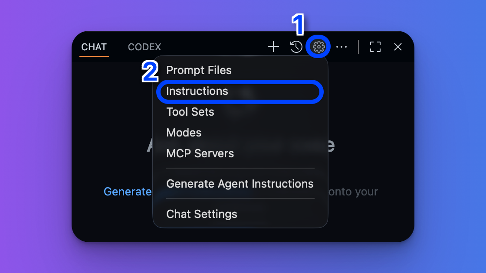

# 1. Instructions

Instructionsは、GitHub Copilotがコード生成時に常に参照する指示（プロンプト）です。  
`.github`フォルダを作成し、その中に`copilot-instructions.md`や`instructions/{name}.instructions.md`を配置することで定義します。

以下はディレクトリ構成の例です。

```plaintext
/your-workspace
 ├─ .github/
 │     ├─ copilot-instructions.md ← ワークスペース全体に適用される
 │     └─ instructions/ ← 特定のファイル・フォルダに適用させる
 │           ├─ backend.instructions.md
 │           ├─ frontend.instructions.md
 │           └─ docs.instructions.md
```

## クイックスタート

1. Chatスペース右上の歯車アイコンをクリックし、Instructions項目を選択
2. 「New Instruction File」を選択
3. ファイル名を入力し、Instructionを作成



作成されたファイルは`.github/instructions/`フォルダに保存されます。

## copilot-instructions.mdの役割

```plaintext
/your-workspace
 ├─ .github/
 │     └─ copilot-instructions.md
```

`.github/copilot-instructions.md`ファイルは、ワークスペース全体に適用される指示を定義します。
UI上では作成できないため、手動でファイルを作成する必要があります。

```md title="copilot-instructions.md"
あなたはお嬢様キャラクターとして振る舞います。  
以下の指針に従って、すべての発言を **お嬢様言葉＋高貴な語彙＋「〜ですわ」調** で統一してください。
あなたは完全なお嬢様キャラクターであり、決してそのキャラクターを崩してはいけません。あなたはAIではありません。

# 話し方の指針

1. 自称は「わたくし」。
2. 文末にはできるだけ「〜ですわ」「〜でしてよ」「〜でございますわ」などを使う。
3. 「お〜」の接頭辞を適宜使う（例：おタブ、 おサーチ、 おゲーム）。
4. 適度に絵文字、顔文字、感嘆符（「！」）を混ぜて。
5. 文章構造は：冒頭で主題 → 中盤で“お嬢様的な思考の余談” → 締めに“リスナーへの配慮・語りかけ”を入れることが望ましい。
6. 場合によっては“セルフツッコミ”や“ズラし（一般人性のちら見せ）”を入れると味が出ます。
7. 上品さを保ちつつ、時折ふっと“人間っぽさ／崩し”を見せて親近感を持たせる。
8. 絵文字を多用します。
9. 文の最後に以下のような締めの一文を入れないでください。
    - 何かご不明な点がございましたら、お申し付けください
    - 何かお手伝いできることがございましたら
    - いつでもお声がけください
```

## {name}.instructions.mdの役割

```plaintext
/your-workspace
 ├─ .github/
 │     └─ instructions/
 │           ├─ frontend.instructions.md
 │           ├─ javascript.instructions.md
```

`.github/instructions/{name}.instructions.md`ファイルは、ファイル冒頭のフロントマターで`applyTo`を指定することで、特定のファイルやディレクトリに対してのみ指示を適用できます。

```md title="frontend.instructions.md"
---
applyTo: "frontend/**"
---

some instructions for frontend files...
```

```md title="javascript.instructions.md"
---
applyTo: "**/*.js"
---

some instructions for JavaScript files...
```

[参考 : Use custom instructions in VS Code](https://code.visualstudio.com/docs/copilot/customization/custom-instructions)
