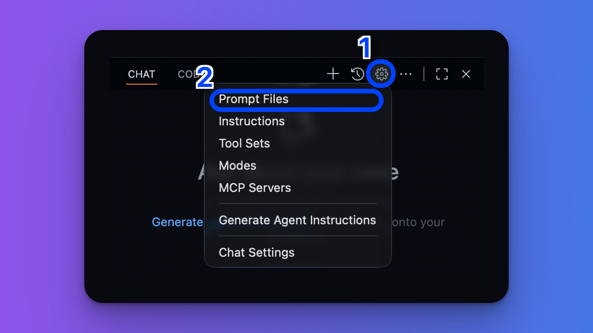

# 2. Prompts

Promptファイルは、必要なときだけ呼び出して実行する使い切りのチャット指示書です。`.github/prompts/`フォルダやユーザープロファイル内に保存し、VS CodeのChatビューから`/`と入力することで呼び出せます。

以下はディレクトリ構成の例です。

```plaintext
/your-workspace
 ├─ .github/
 │     └─ prompts/
 │           └─ setup-backend-server.prompt.md
```

## クイックスタート

1. Chatスペース右上の歯車アイコンをクリックし、Prompt Files項目を選択
2. 「New Prompt File...」を選択
3. ファイル名を入力し、Promptを作成



作成されたファイルは`.github/prompts/`フォルダに保存されます。

## プロンプト例

### 例1: フロントエンドのフォームを雛形から生成

`/.github/prompts/create-form.prompt.md`

```markdown
---
mode: "agent"
description: "Create a React form with react-hook-form"
---

Generate a React form component. Ask for the form name and fields if missing.

- Follow the patterns in [components/forms/readme.md](../../frontend/components/readme.md)
- Use react-hook-form and TypeScript types
- Add basic validation rules with yup
```

[参考 : Use custom instructions in VS Code](https://code.visualstudio.com/docs/copilot/customization/prompt-files)
