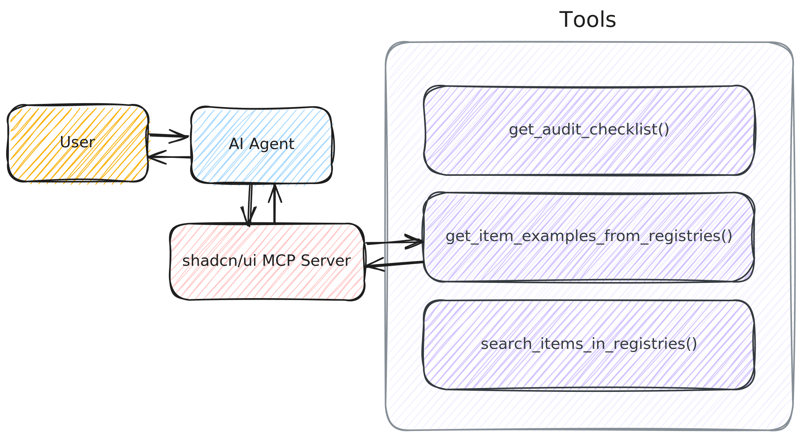

title: 3. MCP Server
nav_order: 3

---

# 3. MCP Server

MCPサーバーは、GitHub Copilotのエージェントモードで外部ツールを利用するためのサーバーです。

例えばフロントエンドでshadcn/uiを採用する場合、GitHub Copilotには大きく2つの課題があります。

1. コンポーネントの使用方法を十分に理解していない🤔
2. 最新の情報を持っていない🤔

ということです。

そこでshadcn開発者が提供するMCPサーバーを利用すると、GitHub Copilotがshadcn/uiの最新コンポーネント情報を取得し、より適切なコードを生成できるようになります。



## クイックスタート

ここでは、[shadcn/uiのMCPサーバー](https://ui.shadcn.com/docs/mcp)を利用する手順を紹介します。

1. `.vscode/mcp.json`ファイルを作成します。
2. 以下の内容を`mcp.json`に追加します。
    ```json
    {
        "servers": {
            "shadcn": {
                "command": "npx",
                "args": ["shadcn@latest", "mcp"]
            }
        }
    }
    ```
3. shadcnのMCPサーバーが起動していることを確認します。

    

## 使ってみよう

MCPサーバーをPromptsと組み合わせて使う方法を紹介します。
よくある課題として、MCPサーバーにアクセスしてほしい状況でも、AIエージェントが参照してくれないケースがあります。その場合は、PromptsでMCPサーバーを必ず参照するよう指示しましょう。
Promptsのフロントマターで`tools`を設定すると、指定したMCPサーバーを利用するよう指示できます。

```markdown title="shadcn.prompt.md"
---
mode: agent
tools: ["shadcn/*"]
---

必ずshadcnのMCPサーバーのツールを使って回答してください。
MCP Serverを実行する前に回答しないでください。
```

次にチャットで`/shadcn`コマンドを使って、shadcnのMCPサーバーを利用するよう指示します。

```markdown
/shadcn テーブルの利用方法を教えてください。
```

以下のようにエージェントがMCPサーバーを参照して、shadcn/uiのテーブルコンポーネントの使用方法を説明してくれたら成功です。


