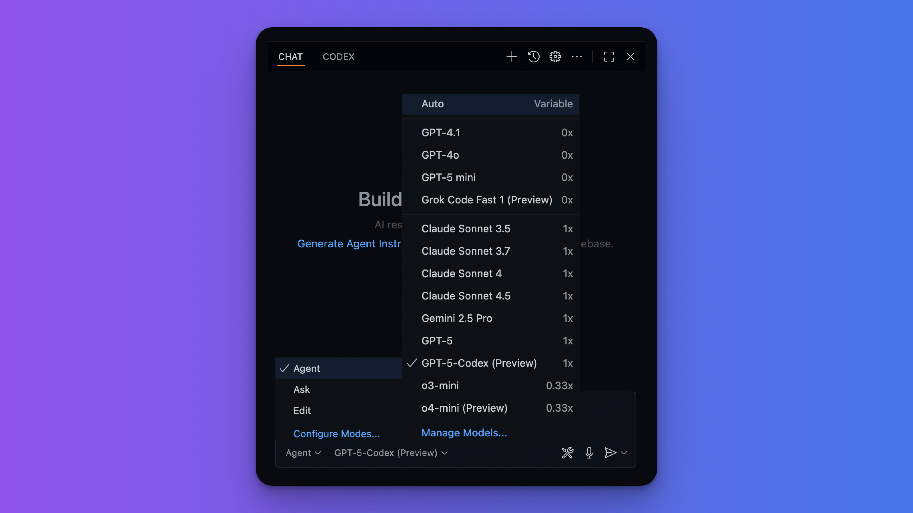
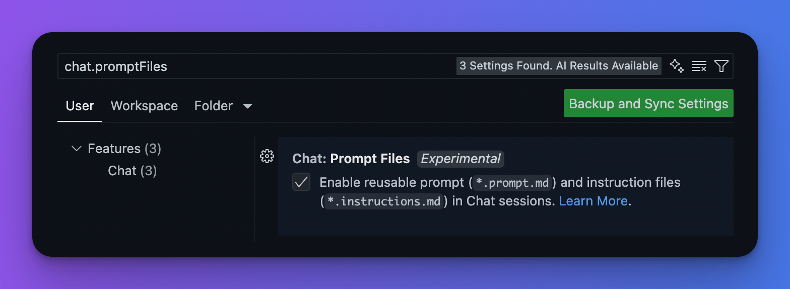

# Github Copilotの使い方

## Github Copilotで利用できる機能

Github Copilotでは、以下のような機能が利用できます。

- **コード補完**: 関数やクラスの定義を自動で補完します。
- **コード生成**: コメントや関数名からコードを生成します。
    - **Ask Mode**: チャットで質問し、内容に応答します。
    - **Edit Mode**: プロンプトに従い、ファイルの編集を行います。
    - **Agent Mode**: プロンプトに従い、タスクを遂行するために複数のファイルを編集、コマンドの実行、MCP Serverの利用などを行います。

また、AIモデルの選択も可能で、OpenAI、Anthropic、Google、Xなどが提供する最新モデルを利用できます。

### AIモデルの選択肢（2025年10月15日時点）

本記事では以下の設定で進めます。

- **コード生成** : Agent Mode
- **AIモデル** : GPT-5-Codex

<figure markdown="span">

  <figcaption>GPT-5-Codexがもっともベンチマークスコアが高い</figcaption>
</figure>

## ワークフローのカスタマイズ

[参考にした公式ドキュメント「Customize chat to your workflow」](https://code.visualstudio.com/docs/copilot/customization/overview)

Github Copilotでは

1. Instructions
2. Prompts
3. MCP Server

といった機能を設定することで、特定の最新情報をカバーしたり、一貫性のあるコード生成が可能になります。
これらは`chat.promptFiles`をあらかじめ有効にしておく必要があります。設定手順は

1. VS Codeの設定を開く（`Cmd + ,`）
2. `chat.promptFiles`で検索
3. `Chat: Prompt Files`にチェックを入れる

