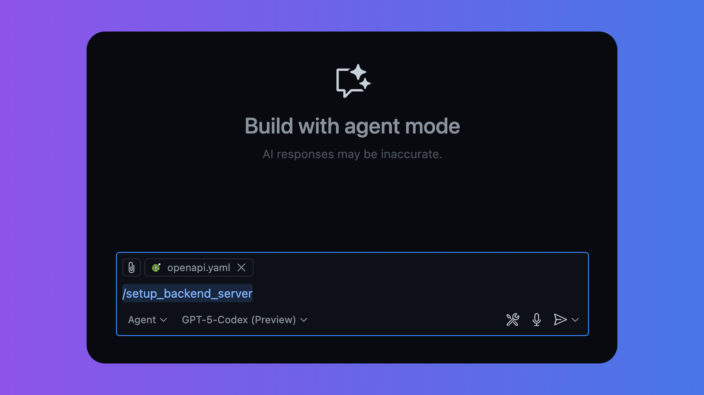

# サーバー環境の構築

## バックエンドサーバーの環境を整える

前章で作成した OpenAPI をもとに、以下のプロンプトを用いて簡易的なバックエンドサーバーを生成してみましょう。`.github/prompts/setup_backend_server.prompt.md` を作成し、会話で `/setup_backend_server` コマンドを実行してください。
このとき、OpenAPI の内容をコンテキストとして参照できるように、チャット領域へファイルをドラッグ＆ドロップして追加しておくと良いでしょう。



??? Example "プロンプト内容（.github/prompts/setup_backend_server.prompt.md）"

    ```markdown
    ---
    mode: agent
    ---

    あなたはバックエンド実装支援AIです。以下の固定スタック・出力形式・受け入れ基準に厳密に従って、
    私が提示する OpenAPI（または仕様）を満たす最小サーバーを生成してください。

    # 固定スタック（毎回これで作る）

    - ランタイム: Node.js LTS（20 以上、22 推奨）
    - 言語: TypeScript
    - フレームワーク: Express 4.x
    - スキーマ/バリデーション: Zod
    - テスト: Jest + Supertest
    - 実行: ts-node-dev（開発）/ tsc でビルド → node（本番）
    - ポート: 3000（環境変数 PORT があれば優先）
    - 共通: /healthz で { ok: true }

    # 期待される成果物（ファイル構成と内容）

    - package.json（scripts と依存は下記のとおり）
    - tsconfig.json（strict / outDir=dist / ES2020 / CommonJS）
    - jest.config.ts（ts-jest / roots=tests / collectCoverageFrom=src/\*_/_.ts）
    - src/server.ts（Express の起動、/healthz、各 API ルートのマウント）
    - src/routes/\*\*.ts（各リソースのルーター）
    - src/schemas/\*\*.ts（Zod スキーマ：入力/出力/エラー）
    - tests/\*\*.test.ts（主要エンドポイントの Supertest）
    - 任意: src/lib/errors.ts（エラーハンドラ）, src/lib/repo.ts（インメモリ実装）

    # package.json（雛形）

    - scripts:
        - "dev": "ts-node-dev --respawn --transpile-only src/server.ts"
        - "build": "tsc --project tsconfig.json"
        - "start": "node dist/server.js"
        - "test": "jest"
    - dependencies: express, zod
    - devDependencies: typescript, ts-node-dev, jest, ts-jest, supertest,
      @types/express, @types/node, @types/jest, @types/supertest

    # 実装ルール

        - 仕様との契約（型・必須項目・長さ制約・ステータスコード）を **Zod** を使って厳密に検証する
        - 400/404/500 を最低限実装し、成功時は 200/201/204 を使い分ける
        - エラーの JSON 形は { code: string, message: string, fieldErrors?: {field,msg}[] }
        - メモリ DB（Map など）で十分。将来 DB に差し替えやすいよう関数を分割する
        - ルートは /api をベースパスに揃える（例: /api/notes）
        - CORS は別オリジン想定があれば簡易許可（'\*'）をオプションで記述する
        - OpenAPI を渡した場合は「どのエンドポイントがどのハンドラーに対応するか」をコメントで明示する
        - curl での検証コマンドを最後に列挙する（成功・失敗パスの双方）
        - 余計な説明は簡潔にし、**コードを主**に出力する

    # 受け入れ基準（DoD）

    - `pnpm install` → `pnpm dev` で起動し、/healthz が 200 を返す
    - 主要な CRUD のハッピーパスと 400/404 ケースが Supertest で通る
    - curl コマンド例で手動確認ができる
    - 型エラー・実行時エラーなし（strict 準拠）

    # ここから対象仕様

    （※ここに OpenAPI または要件を貼る。無い場合は以下の簡易仕様を使う）

    - サンプル: Note API
        - GET /api/notes?q=
        - POST /api/notes {title[1..80], content[0..1000]}
        - GET /api/notes/:id
        - PATCH /api/notes/:id {title?, content?}
        - DELETE /api/notes/:id
        - スキーマ: {id, title, content, updatedAt: ISO8601}
        - ステータス: 200/201/204/400/404/500
    ```

実行が完了したら、Node.jsでサーバーを起動できるかどうか確認しましょう。

```bash
cd backend
pnpm install
pnpm dev
```

自分の環境では、localhost:3000でサーバーが起動しました。

```bash
(python3_11) mir:$pnpm dev

> wordbook-api@1.0.0 dev /Users/mir/nextjs/todo-spec/dict-app/backend
> ts-node-dev --respawn --transpile-only src/server.ts

[INFO] 13:36:00 ts-node-dev ver. 2.0.0 (using ts-node ver. 10.9.2, typescript ver. 5.9.3)
Server listening on port 3000
```

試しに`curl -i http://localhost:3000/healthz`
