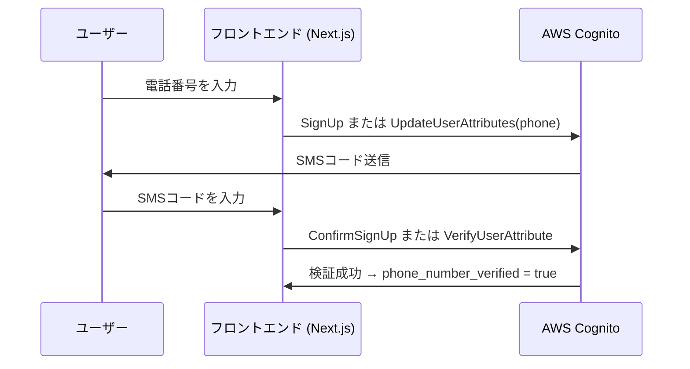

# Mkdocs ドキュメントの使い方

## コードハイライト

### タイトルをつける

````md
```py title="example.py"

```
````

```py title="example.py"
def example_function():
    return "This is an example."
```

### ハイライト・ナンバー

````md
```py hl_lines="2 3 4" linenums="1"

```
````

```py hl_lines="2 3 4" linenums="1"
def example_function():
    return "This is an example."

print(example_function())
```

## Todo リスト

```
- [x] Lorem ipsum dolor sit amet, consectetur adipiscing elit
- [ ] Vestibulum convallis sit amet nisi a tincidunt
    - [x] In hac habitasse platea dictumst
    - [ ] Praesent sed risus massa
```

- [x] Lorem ipsum dolor sit amet, consectetur adipiscing elit
- [ ] Vestibulum convallis sit amet nisi a tincidunt
    - [x] In hac habitasse platea dictumst
    - [ ] Praesent sed risus massa

## Admonitions

- `note`
- `abstract`
- `info`
- `tip`
- `success`
- `question`
- `warning`
- `failure`
- `danger`
- `bug`
- `example`
- `quote`

などがある。

```
!!! warning "注意"

    Lorem ipsum dolor sit, amet consectetur adipisicing elit. Tempora culpa fuga omnis possimus doloremque corrupti neque voluptas sequi! Aliquam ullam non unde, corrupti illum commodi. Ducimus dolorum voluptates pariatur nemo.
```

!!! warning "注意"

    Lorem ipsum dolor sit, amet consectetur adipisicing elit. Tempora culpa fuga omnis possimus doloremque corrupti neque voluptas sequi! Aliquam ullam non unde, corrupti illum commodi. Ducimus dolorum voluptates pariatur nemo.

## Mermaid



## 脚注

```
この文章に脚注を付けたい[^1]

[^1]: これは脚注の内容です。
```

この文章に脚注を付けたい[^1]

[^1]: これは脚注の内容です。
